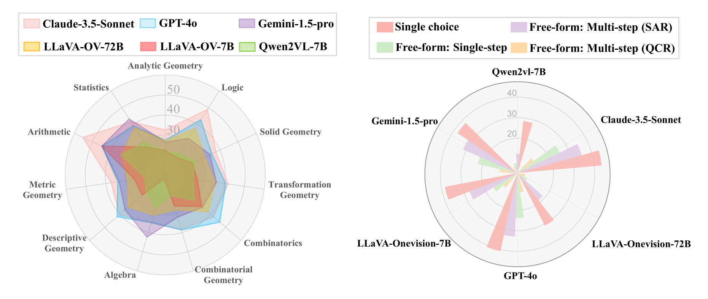
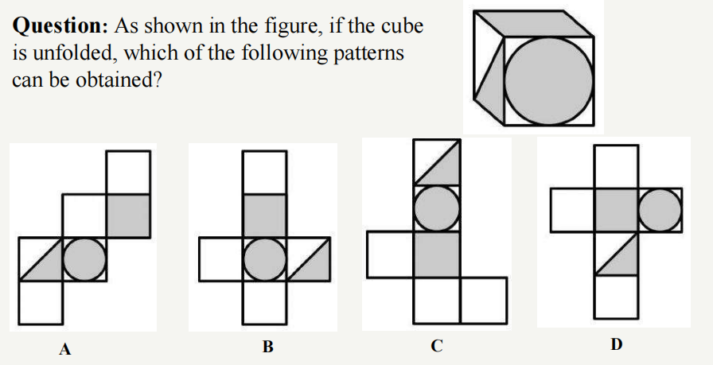
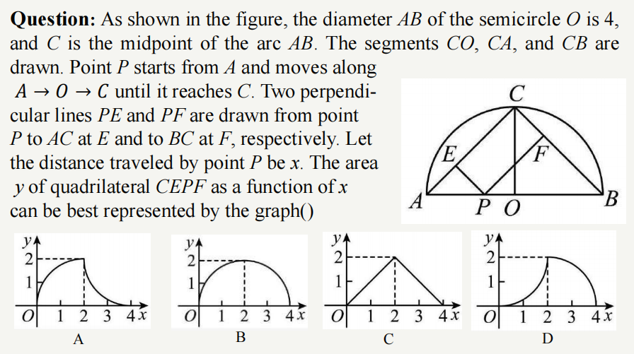
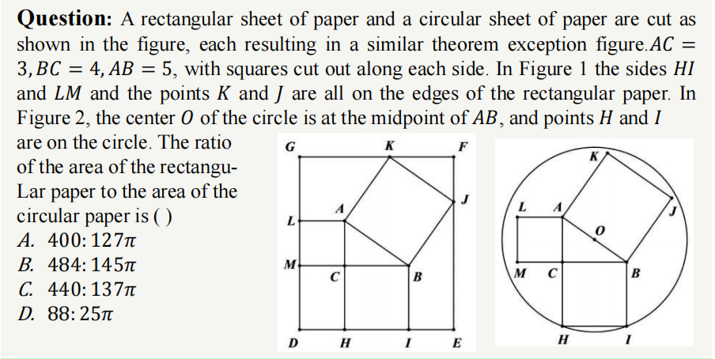

# MV-MATH🔥: Evaluating Multimodal Math Reasoning in Multi-Visual Contexts

 
 
 

 
 


🌟  This is the official repository for the paper "[MV-MATH: Evaluating Multimodal Math Reasoning in Multi-Visual Contexts](https://openaccess.thecvf.com/content/CVPR2025/html/Wang_MV-MATH_Evaluating_Multimodal_Math_Reasoning_in_Multi-Visual_Contexts_CVPR_2025_paper.html)", which contains both evaluation code and data for the **MV-MATH** benchmark.

[[🌐 Homepage](https://eternal8080.github.io/MV-MATH.github.io/)] [[🤗 Huggingface Dataset](https://huggingface.co/datasets/PeijieWang/MV-MATH)] [[📊 Leaderboard ](https://eternal8080.github.io/MV-MATH.github.io/)] [[🔍 Visualization](https://eternal8080.github.io/MV-MATH.github.io/)] [[📖 ArXiv Paper](https://arxiv.org/abs/2502.20808)]

## 💥 News
- **[2025-07-21]** 🌟 **Qwen-VL-Max** achieves a strong **42.4%**, 🎯**Seed1.5-VL (thinking)** achieves a stunning **72.9%** on **MV-MATH**, setting a new **SOTA**. 🎉 Congratulations!
- **[2025-03-01]** 🚀🚀🚀 See this page for the [homepage](https://eternal8080.github.io/MV-MATH.github.io/) pf **MV-MATH**
- **[2025-03-01]** O1-like model **QVQ-72B-Preview** achieves **29.3%**, establishing itself as the new best-performing open-sourced model. 🎉 Congratulations!
- **[2025-02-27]** Our dataset is now accessible at [huggingface](https://huggingface.co/datasets/PeijieWang/MV-MATH).
- **[2025-02-27]** The top-performing model, **Claude-3.5-Sonnet** only scores **33.9%** on **MV-MATH**, while human performance is around **76%**.
- **[2025-02-27]** **MV-MATH** is accepted by **CVPR2025**! 🎉🎉🎉

## 👀 Introduction

MV-MATH is a meticulously annotated dataset designed to evaluate the mathematical reasoning capabilities of MLLMs in multi-visual contexts. Each sample in MV-MATH consists of interleaved multi-image and text. It comprises 2,009 multi-image questions, with some questions containing up to 8 images. It includes three types: multiple-choice, free-form and multi-step questions.

MV-MATH is organized into 11 subjects over 3 difficulty levels, including Analytic Geometry, Algebra, Metric Geometry, Combinatorics, Transformation Geometry, Logic, Solid Geometry, Arithmetic, Combinatorial Geometry, Descriptive Geometry and Statistics, covering a range of scenarios from the K-12 mathematics curriculum.

Based on image relevance, we categorize MV-MATH into two subsets: a **mutually dependent set (MD)**, where images are interrelated and understanding one image necessitates information from another; and an **independent set (ID)**, where images are unrelated and can be interpreted independently without reference to other images.


<p align="center">
     <br>
  The accuracies of 6 prominent Multimodal Large Multimodal Models (MLMMs) are evaluated on our proposed <b>MV-MATH</b> across 11 subjects.
</p>

Through extensive experimentation, we unveil a notable performance gap between current MLMMs and human performance on MV-MATH, underscoring the imperative for further advancements in MLMMs.


You can refer to our [project homepage](https://eternal8080.github.io/MV-MATH.github.io/) and [the paper](https://arxiv.org/abs/2502.20808) for more details.

## 📐 Dataset Examples

Some examples of MV-MATH on three subjects: analytic geometry, topology, and graph theory.

<details>
<summary>Solid Geometry</summary><p align="center">
     <br>
</p></details>

<details>
<summary>Analytic Geometry</summary><p align="center">
     <br>
</p></details>

<details>
<summary>Algebra</summary><p align="center">
     <br>
</p></details>

You can refer to the Appendix A.4 of [the paper](https://arxiv.org/pdf/2502.20808) for example images of 11 subjects.

## 🏆 Leaderboard

The leaderboard is available [here](https://eternal8080.github.io/MV-MATH.github.io/).


## 📈 Evaluation

### Generating Outputs of Different Models

#### API MODEL

`python models/API_model.py`

This will run the GPT-4o/Claude-3.5-Sonnet/Gemini-1.5-pro/GPT-4v API and save the outputs to `./API_name.jsonl` path. You can modify the system prompt, max tokens, etc.

#### Claude_with_caption

Generate image captions using Claude-3.5-Sonnet:

`python models/Caption_Claude.py`

Then you can use the generated merge data and image to inference.


### Evaluation of Model Outputs

Once all the model outputs have been generated, execute the `python evaluation/evaluate_choice.py`  `python evaluation/evaluate_freeform.py` `python evaluation/evaluate_freeform.py`function to assess these outputs, and the run `python evaluation/merge_score.py`. This script will examine all outputs located in the `outputs/` directory, computing overall accuracy.

You can refer to the Appendix H of [the paper](https://arxiv.org/pdf/2502.20808) for some evaluation results of the above models and case study.

## 📝 Citation

If you find this benchmark useful in your research, please consider citing this BibTex:

```
@inproceedings{wang2025mv,
  title={Mv-math: Evaluating multimodal math reasoning in multi-visual contexts},
  author={Wang, Peijie and Li, Zhong-Zhi and Yin, Fei and Ran, Dekang and Liu, Cheng-Lin},
  booktitle={Proceedings of the Computer Vision and Pattern Recognition Conference},
  pages={19541--19551},
  year={2025}
}
```

## 🧠 Related Work
- **[Survey🔥🔥]** [From System 1 to System 2: A Survey of Reasoning Large Language Models](https://arxiv.org/abs/2502.17419)
- **[CMMaTH🔥🔥]** [CMMaTH: A Chinese Multi-modal Math Skill Evaluation Benchmark for Foundation Models](https://aclanthology.org/2025.coling-main.184/)
- **[GeoEval🔥🔥]** [GeoEval: Benchmark for Evaluating LLMs and Multi-Modal Models on Geometry Problem-Solving](https://eternal8080.github.io/GeoEval.github.io/)
- **[Math-Vision🔥]** [Measuring Multimodal Mathematical Reasoning with the MATH-Vision Dataset](https://github.com/mathllm/MATH-V)
- **[MathVerse🔥]** [MathVerse: Does Your Multi-modal LLM Truly See the Diagrams in Visual Math Problems?](https://github.com/ZrrSkywalker/MathVerse)
- **[MathVista🔥]** [MathVista: Evaluating Mathematical Reasoning of Foundation Models in Visual Contexts](https://github.com/lupantech/MathVista)
